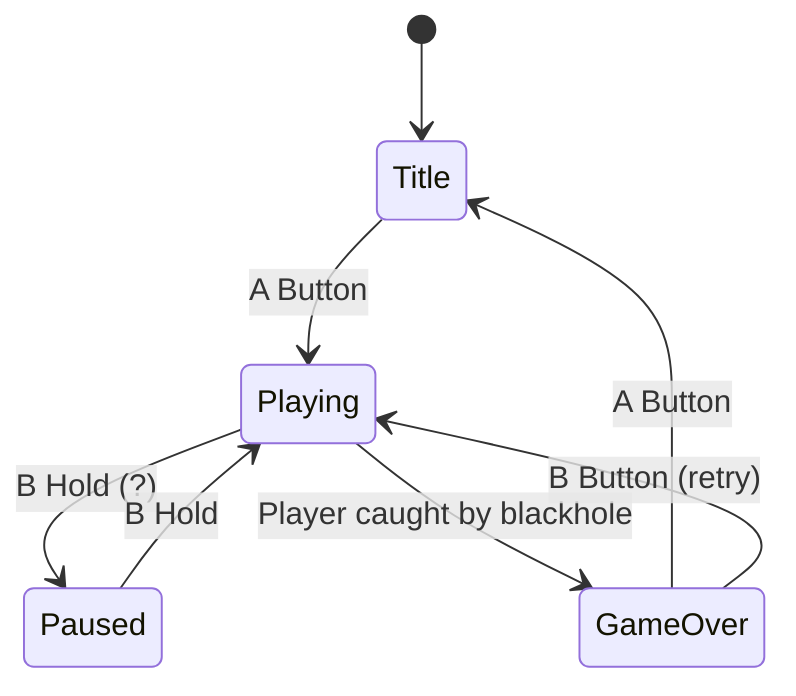
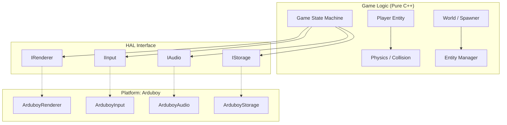

# Supermassive Blackhole — Game Design & Implementation Plan

## Game Concept

**Title:** Supermassive Blackhole  
**Platform:** Arduboy (128×64, 1-bit, ATmega32u4: 32KB Flash, 2.5KB RAM)  
**Jam:** [1-Bit Jam 14](https://itch.io/jam/1-bit-jam-14) — Theme: **Blackhole**  
**Genre:** Top-down arcade survival / score attack

A fat man runs on a pseudo-3D top-down infinite plane, dodging delicious food and fleeing a pursuing supermassive blackhole. Players score by collecting items and surviving as long as possible. The game emphasizes skillful analog-feel directional control on limited hardware, inspired by the car control in [Crates](https://jessemillar.itch.io/crates).

---

## Core Mechanics

### Player Control (Inspired by Crates)
- **D-Pad**: 8-directional movement (up, down, left, right, diagonals)
- **A Button**: Accelerate / sprint
- **B Button**: Brake / slow down
- Player has **velocity** and **friction** — movement feels weighty and momentum-based
- The "fat man" character slides and drifts slightly, rewarding precise control

### Blackhole Chase
- A supermassive blackhole pursues the player from behind (or from a fixed direction that slowly intensifies)
- The blackhole's gravitational pull increases over time, making the game progressively harder
- Visual: the blackhole warps/pulls nearby objects toward it (simulated with sprite displacement)

### Food Obstacles
- Delicious food items (burgers, pizza, donuts — placeholder shapes: triangles, squares, circles) spawn on the infinite plane
- Touching food **slows the player down** (the fat man can't resist!) and/or costs a life
- Different food types have different penalty behaviors

### Collectibles & Scoring
- Collectible items (stars, gems — placeholder: small diamonds/dots) spawn on the plane
- Each collected item increments score
- Score also passively increases with survival time
- High score saved to EEPROM

### Infinite Plane
- Camera follows the player; the world scrolls infinitely
- Background rendered with a scrolling dot/grid pattern to convey movement
- Objects spawn ahead of the player and despawn behind (off-screen culling)

---

## Game States



| State | Description |
|-------|-------------|
| **Title** | Logo, "Press A to Start", high score display |
| **Playing** | Main gameplay loop |
| **Paused** | Freeze game state (optional, may skip for jam) |
| **GameOver** | Final score, high score update, retry prompt |

---

## Technical Architecture

> [!IMPORTANT]
> The architecture separates **game logic** from **platform I/O** via a Hardware Abstraction Layer (HAL). This allows future porting to Raylib, SDL, or other engines by swapping only the HAL implementation.

### Layer Diagram



### Key Design Decisions

| Decision | Choice | Rationale |
|----------|--------|-----------|
| Language | **C++** (Arduino-compatible subset) | Best Arduboy ecosystem support, struct/class support, no RTTI/exceptions |
| Math | **Fixed-point (Q8.8 int16_t)** | No FPU on ATmega32u4; avoid `float` entirely |
| Memory | **Static allocation only** | 2.5KB RAM — no `new`, `malloc`, `String` |
| Sprites | **PROGMEM arrays** | Constant data stored in Flash, not RAM |
| Trig | **Lookup tables in PROGMEM** | Pre-computed sin/cos for 256 angles |
| Entity limit | **Max ~12 on-screen entities** | RAM budget: ~40 bytes per entity × 12 ≈ 480 bytes |
| HAL binding | **Compile-time (no virtual)** | `virtual` vtables waste RAM on AVR; use templates or `#ifdef` |

---

## Proposed Directory Structure

```
blackhole/
├── blackhole.ino              # Arduino entry point (setup/loop, wires HAL to Game)
├── src/
│   ├── game/                  # Pure game logic (platform-independent)
│   │   ├── game.h             # Game class: state machine, main update/render
│   │   ├── game.cpp
│   │   ├── player.h           # Player entity: position, velocity, state
│   │   ├── player.cpp
│   │   ├── entity.h           # Base entity struct + EntityManager
│   │   ├── entity.cpp
│   │   ├── world.h            # Infinite plane, spawning, camera
│   │   ├── world.cpp
│   │   ├── physics.h          # Collision detection, movement
│   │   ├── physics.cpp
│   │   └── config.h           # Game constants (speeds, limits, sizes)
│   ├── hal/                   # Hardware Abstraction Layer interfaces
│   │   ├── renderer.h         # IRenderer: drawRect, drawCircle, drawSprite, clear, display
│   │   ├── input.h            # IInput: isPressed, justPressed (button enum)
│   │   ├── audio.h            # IAudio: playTone, playScore (stub for now)
│   │   └── storage.h          # IStorage: saveHighScore, loadHighScore (EEPROM)
│   └── platform/
│       └── arduboy/           # Arduboy-specific HAL implementations
│           ├── arduboy_renderer.h
│           ├── arduboy_renderer.cpp
│           ├── arduboy_input.h
│           ├── arduboy_input.cpp
│           ├── arduboy_audio.h
│           ├── arduboy_audio.cpp
│           ├── arduboy_storage.h
│           └── arduboy_storage.cpp
├── assets/                    # Sprite data, bitmaps (PROGMEM arrays)
│   └── sprites.h              # Placeholder shape definitions
├── build/                     # Arduino IDE build output (gitignored)
├── dist/                      # Distribution binaries (gitignored)
├── docs/                      # Design docs, references
│   └── gdd.md                 # This game design document (symlink or copy)
├── html5/                     # Web build (gitignored)
└── README.md
```

---

## Proposed Changes

### [NEW] `.gitignore` — Updated for Arduino/C++ project
Comprehensive gitignore covering Arduino build artifacts, PlatformIO, IDE files, and OS junk.

---

### Game Logic Component

#### [NEW] [`src/game/config.h`](file:///home/dorito/Developer/arduboy/blackhole/src/game/config.h)
Game-wide constants: screen dimensions, physics tuning, entity limits, fixed-point helpers.

#### [NEW] [`src/game/entity.h`](file:///home/dorito/Developer/arduboy/blackhole/src/game/entity.h) / [`entity.cpp`](file:///home/dorito/Developer/arduboy/blackhole/src/game/entity.cpp)
- `EntityType` enum: `FOOD_BURGER`, `FOOD_PIZZA`, `FOOD_DONUT`, `COLLECTIBLE`, `BLACKHOLE`
- `Entity` struct: position (fixed-point), velocity, type, active flag, size
- `EntityManager`: static array of entities, spawn/despawn, iteration

#### [NEW] [`src/game/player.h`](file:///home/dorito/Developer/arduboy/blackhole/src/game/player.h) / [`player.cpp`](file:///home/dorito/Developer/arduboy/blackhole/src/game/player.cpp)
- Position, velocity (fixed-point x,y)
- Facing direction (8-dir enum or angle)
- `update(inputState)`: apply acceleration/friction based on input
- `getHitbox()`: for collision

#### [NEW] [`src/game/physics.h`](file:///home/dorito/Developer/arduboy/blackhole/src/game/physics.h) / [`physics.cpp`](file:///home/dorito/Developer/arduboy/blackhole/src/game/physics.cpp)
- AABB collision detection between player and entities
- Blackhole gravitational pull calculation (vector toward player)
- Boundary-free movement (infinite plane)

#### [NEW] [`src/game/world.h`](file:///home/dorito/Developer/arduboy/blackhole/src/game/world.h) / [`world.cpp`](file:///home/dorito/Developer/arduboy/blackhole/src/game/world.cpp)
- Camera position (follows player)
- Entity spawning logic (spawn ahead of player, cull behind)
- Difficulty ramping (increase spawn rate, blackhole speed over time)
- Scrolling background grid

#### [NEW] [`src/game/game.h`](file:///home/dorito/Developer/arduboy/blackhole/src/game/game.h) / [`game.cpp`](file:///home/dorito/Developer/arduboy/blackhole/src/game/game.cpp)
- `GameState` enum: `TITLE`, `PLAYING`, `GAME_OVER`
- `Game` class: owns Player, World, EntityManager
- `update()`: state machine dispatch → input → physics → spawn → collision → render
- `render(IRenderer&)`: draw world, entities, player, HUD

---

### HAL Interface Component

#### [NEW] [`src/hal/renderer.h`](file:///home/dorito/Developer/arduboy/blackhole/src/hal/renderer.h)
```cpp
struct IRenderer {
    void clear();
    void display();
    void drawRect(int16_t x, int16_t y, uint8_t w, uint8_t h, uint8_t color);
    void fillRect(int16_t x, int16_t y, uint8_t w, uint8_t h, uint8_t color);
    void drawCircle(int16_t x, int16_t y, uint8_t r, uint8_t color);
    void fillCircle(int16_t x, int16_t y, uint8_t r, uint8_t color);
    void drawTriangle(int16_t x0, int16_t y0, ...);
    void setCursor(int16_t x, int16_t y);
    void print(const char* text);
    void printNumber(int32_t number);
};
```
> Not `virtual` — implemented via compile-time template parameter or `#ifdef` platform switch.

#### [NEW] [`src/hal/input.h`](file:///home/dorito/Developer/arduboy/blackhole/src/hal/input.h)
```cpp
enum Button { BTN_UP, BTN_DOWN, BTN_LEFT, BTN_RIGHT, BTN_A, BTN_B };
struct IInput {
    void poll();
    bool pressed(Button b);
    bool justPressed(Button b);
};
```

#### [NEW] [`src/hal/audio.h`](file:///home/dorito/Developer/arduboy/blackhole/src/hal/audio.h)
Stub interface for future sound effects.

#### [NEW] [`src/hal/storage.h`](file:///home/dorito/Developer/arduboy/blackhole/src/hal/storage.h)
```cpp
struct IStorage {
    void saveHighScore(uint16_t score);
    uint16_t loadHighScore();
};
```

---

### Platform Implementation Component (Arduboy)

#### [NEW] `src/platform/arduboy/arduboy_renderer.h/.cpp`
Wraps `Arduboy2` draw calls (`arduboy.drawRect(...)`, etc.).

#### [NEW] `src/platform/arduboy/arduboy_input.h/.cpp`
Wraps `arduboy.pressed()`, `arduboy.justPressed()`, maps to `Button` enum.

#### [NEW] `src/platform/arduboy/arduboy_audio.h/.cpp`
Stub wrapping `ArduboyTones` (or empty for now).

#### [NEW] `src/platform/arduboy/arduboy_storage.h/.cpp`
Wraps `EEPROM.put()` / `EEPROM.get()` for high score persistence.

---

### Assets Component

#### [NEW] [`assets/sprites.h`](file:///home/dorito/Developer/arduboy/blackhole/assets/sprites.h)
Placeholder sprite definitions as PROGMEM byte arrays — basic geometric shapes:
- **Player (fat man)**: Large filled circle (~10×10 px)
- **Food items**: Triangle (pizza), square (burger), small circle (donut)
- **Collectible**: Small diamond shape (~4×4 px)
- **Blackhole**: Large concentric circles with radiating lines (~20×20 px)

---

### Entry Point

#### [MODIFY] [`blackhole.ino`](file:///home/dorito/Developer/arduboy/blackhole/blackhole.ino)
Wire everything together:
```cpp
#include <Arduboy2.h>
#include "src/platform/arduboy/arduboy_renderer.h"
#include "src/platform/arduboy/arduboy_input.h"
#include "src/platform/arduboy/arduboy_storage.h"
#include "src/game/game.h"

Arduboy2 arduboy;
ArduboyRenderer renderer(arduboy);
ArduboyInput input(arduboy);
ArduboyStorage storage;
Game game;

void setup() {
    arduboy.begin();
    arduboy.setFrameRate(60);
    game.init(storage);
}

void loop() {
    if (!arduboy.nextFrame()) return;
    input.poll();
    game.update(input);
    renderer.clear();
    game.render(renderer);
    renderer.display();
}
```

---

## User Review Required

> [!IMPORTANT]
> **Control Scheme**: I've mapped D-pad to 8-directional movement with A=accelerate, B=brake. In "Crates", left/right rotate the car's heading angle and up/down aren't used. Do you want:
> - **(a)** True 8-directional (D-pad directly sets movement direction) — simpler, more intuitive
> - **(b)** Rotation-style (left/right change facing angle, A=accelerate forward, B=brake) — more like Crates, harder to master
> - **(c)** Hybrid (D-pad sets direction, but movement has strong inertia/drift so it *feels* like rotation)

> [!IMPORTANT]
> **HAL Binding Strategy**: For AVR, `virtual` functions add vtable overhead (~2 bytes/pointer per method). I'm proposing **compile-time binding** (template parameters or `#ifdef`) instead, which has zero overhead but is slightly less elegant. Is this acceptable, or would you prefer `virtual` interfaces for cleaner code even at cost?

> [!WARNING]
> **Scope for Jam**: This plan includes audio stubs and pause state. For the jam deadline, we could cut those and focus on core gameplay (Title → Playing → GameOver). Should I trim scope?

## Open Questions

1. **Blackhole behavior**: Should the blackhole chase from a fixed edge (like a rising lava wall) or actively track the player's position? The former is simpler and creates clear directional pressure; the latter is more dynamic.

2. **Food penalty**: When the fat man touches food, should it (a) slow him temporarily, (b) add weight/reduce max speed permanently until game over, or (c) stun briefly? Each creates different strategic depth.

3. **Visual style for the "infinite plane"**: A scrolling dot grid? Checkerboard? Perspective lines converging to suggest 3D depth? The Arduboy's 1-bit constraint limits options but a dot grid is cheapest.

4. **Difficulty curve**: Linear increase in blackhole speed + spawn rate? Or wave-based with brief rest periods?

---

## Development Milestones

| Phase | Deliverable | Priority |
|-------|-------------|----------|
| **M0** | Project scaffold, directory structure, HAL interfaces, `.gitignore` | 🔴 Now |
| **M1** | Player movement on scrolling plane with momentum physics | 🔴 High |
| **M2** | Entity spawning (food + collectibles), collision detection, scoring | 🔴 High |
| **M3** | Blackhole chase mechanic, difficulty ramping | 🔴 High |
| **M4** | Game states (Title, GameOver), high score (EEPROM) | 🟡 Medium |
| **M5** | Polish: placeholder art → real sprites, visual effects | 🟡 Medium |
| **M6** | Audio (tones/SFX), pause state | 🟢 Low |
| **M7** | Playtesting, balance tuning, jam submission | 🔴 High |

---

## Verification Plan

### Automated Tests
- Compile with Arduino CLI: `arduino-cli compile --fqbn arduboy:avr:arduboy ./`
- Verify Flash usage stays under 28KB (leaving room for bootloader)
- Verify RAM usage stays under ~2KB (leaving headroom for stack)

### Manual Verification
- Test on ProjectABE emulator for gameplay feel
- Verify on physical Arduboy hardware
- Confirm all game states transition correctly
- Test high score persistence across reboots
